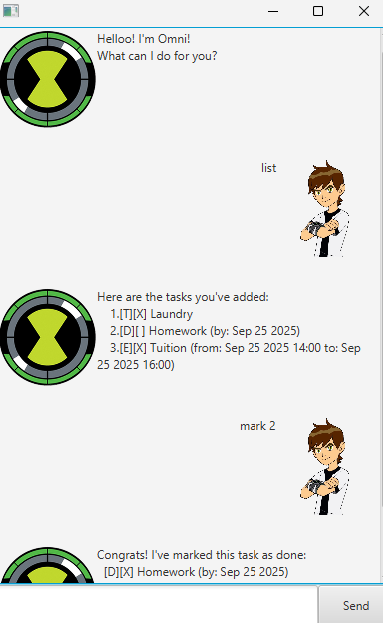

# Omni User Guide



Omni is a task management application that helps you keep track of your todos, deadlines, and events. It features a clean GUI interface and supports various task operations to help you stay organized.

## Quick Start

1. Ensure you have Java 17 or above installed.
2. Download the latest `omni.jar` from the releases page.
3. Move the file into an empty folder.
4. Double-click the jar file or run `java -jar omni.jar` to start the application.
5. Type commands in the text box at the bottom and press Enter to execute them.

## Features

### Adding a Todo Task

Adds a simple todo task without any date or time.

**Format:** `todo DESCRIPTION`

**Example:** `todo Buy groceries`

**Expected output:**
```
Got it. I've added this task:
  [T][ ] Buy groceries
Now you have 1 task in the list.
```

### Adding a Deadline

Adds a task with a deadline date and optional time.

**Format:** `deadline DESCRIPTION /by DATE [TIME]`

**Date format:** DD-MM-YYYY
**Time format:** HHMM (24-hour format)

**Examples:** 
- `deadline Submit assignment /by 25-09-2025`
- `deadline Submit assignment /by 25-09-2025 2359`

**Expected output:**
```
Got it. I've added this task:
  [D][ ] Submit assignment (by: Sep 25 2025)
Now you have 2 tasks in the list.
```

### Adding an Event

Adds an event with start and end dates with times (optional).

**Format:** `event DESCRIPTION /from START_DATE [START_TIME] /to END_DATE [END_TIME]`

**Examples:**
- `event Team meeting /from 26-09-2025 1400 /to 26-09-2025 1500`
- `event Conference /from 01-10-2025 /to 03-10-2025`

**Expected output:**
```
Got it. I've added this task:
  [E][ ] Team meeting (from: Sep 26 2025 14:00 to: Sep 26 2025 15:00)
Now you have 3 tasks in the list.
```

### Listing All Tasks

Displays all tasks in your list with their status and details.

**Format:** `list`

**Expected output:**
```
Here are the tasks you've added:
    1.[T][ ] Buy groceries
    2.[D][ ] Submit assignment (by: Sep 25 2025)
    3.[E][ ] Team meeting (from: Sep 26 2025 14:00 to: Sep 26 2025 15:00)
```

### Marking Tasks as Done

Marks a task as completed.

**Format:** `mark TASK_NUMBER`

**Example:** `mark 1`

**Expected output:**
```
Congrats! I've marked this task as done:
  [T][X] Buy groceries
```

### Unmarking Tasks

Marks a completed task as not done.

**Format:** `unmark TASK_NUMBER`

**Example:** `unmark 1`

**Expected output:**
```
Sure thing, I've marked this task as not done yet:
  [T][ ] Buy groceries
```

### Deleting Tasks

Removes a task from your list permanently.

**Format:** `delete TASK_NUMBER`

**Example:** `delete 1`

**Expected output:**
```
Gotchu, I've deleted this task for you:
  [T][ ] Buy groceries
```

### Finding Tasks

Searches for tasks containing a specific keyword.

**Format:** `find KEYWORD`

**Example:** `find assignment`

**Expected output:**
```
Here are the matching tasks in your list:
    1.[D][ ] Submit assignment (by: Sep 25 2025)
```

### Updating Tasks

Modifies existing task details. You can update descriptions, deadlines, or event times in the same command string.
Update tags are:
1. description: `/desc`
2. deadline: `/by`
3. event start: `/from`
4. event end: `/to`

**Format:** `update TASK_NUMBER <tag> UPDATED_FIELD ...`


**Examples:**
- `update 1 /desc Complete grocery shopping`
- `update 2 /by 30-09-2025 1800`
- `update 3 /from 26-09-2025 1500 /to 26-09-2025 1600 /desc Group project meeting`

**Expected output (Example 1):**
```
Alrighty, I've updated this task for you:
  [T][ ] Complete grocery shopping
```

### Exiting the Application

Closes the application.

**Format:** `bye`

**Expected output:**
```
Byeee! See you in a bit!
```

## Task Status Icons

- `[T]` - Todo task
- `[D]` - Deadline task  
- `[E]` - Event task
- `[ ]` - Task not completed
- `[X]` - Task completed

## Date and Time Format

- **Date:** DD-MM-YYYY (e.g., 25-09-2025)
- **Time:** HHMM in 24-hour format (e.g., 1400 for 2:00 PM)
- **Date and Time:** DD-MM-YYYY HHMM (e.g., 25-09-2025 1400)

## Data Storage

Your tasks are automatically saved to `data/tasks.txt` and will be loaded when you restart the application.

## Error Messages

If you encounter any errors, Omni will provide helpful messages to guide you:
- Invalid date formats will prompt you to use DD-MM-YYYY HHMM
- Missing task descriptions will ask you to provide one
- Invalid task numbers will inform you the task doesn't exist

## Tips

1. Task numbers start from 1 and correspond to the order shown in the `list` command.
2. You can update multiple aspects of a task in one command (e.g., both description and date).
3. Time is optional for dates - you can specify just the date if no specific time is needed.
4. The find command searches through task descriptions and is case-insensitive.
